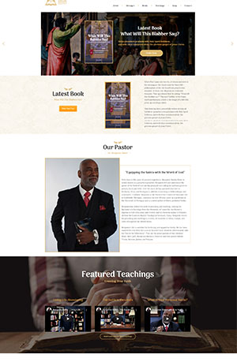
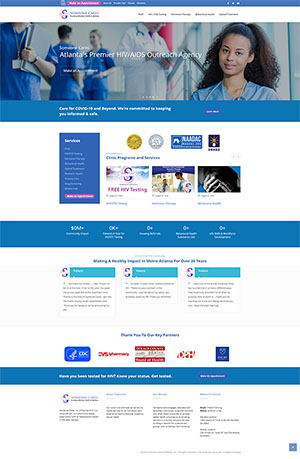
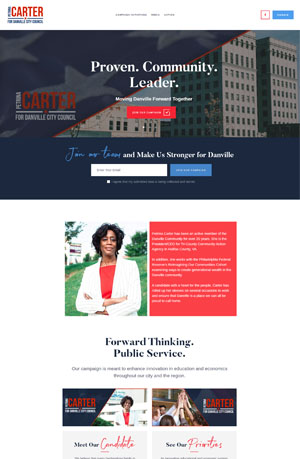
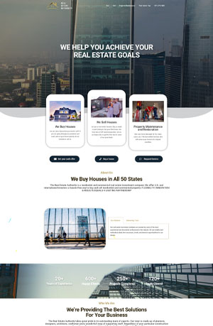

<!DOCTYPE html>
<html lang="en">
<head>
    <meta charset="UTF-8">
    <meta name="viewport" content="width=device-width, initial-scale=1.0">
    <title>Vlad Jecan - Developer</title>
    <base href="/">
    <link rel="stylesheet" href="style.css">
<link rel="stylesheet" href="styles.2099ff2cae5460b996ff.css"></head>
<body>
    
    <header>  
        
<a href="http://vjecan.github.io">VJ.</a>

        

        

            

            

            

        
 
        

            

                <ul>
                <li><a href="#about">
01.
 About</a></li>
                <li><a href="#exp">
02.
 Experience</a></li>
                <li><a href="#projects">
03.
 Projects</a></li>
                <li><a href="#contact">
04.
 Contact</a></li>
                <a href="./assets/vlad-resume.pdf"><button class="btn">Resume</button></a>
                </ul>
                
     
        

    </header>
    

    

        <h3 class="hello">Hi, my name is</h3>
        <h1 class="vlad">Vlad Jecan</h1>
        <h2 class="info">I am a Web Developer</h2>

        <a href="mailto:vjecan@gmail.com"><button class="btn-main">Get in Touch</button></a>
    

    
   <section id="exp" class="exp">
    
02.Experience

           

            

            
Jasudo

            
UGA

            
UBB

            
CPR

            

            
            

            

                

                 <h1>Assist. Project Manager and Web Developer</h1>
                 <a href="http://jasudo.com"><h3>Jasudo Technologies</a></h3>
                 <h4>July 2020 - Present (Part-Time)</h4>
                 <ul>
                     <li>Ensure successful completion of web development projects.</li>
                     <li>Full circle WordPress development and maintenance.</li>
                     <li>Bug fixing ever-breaking page builders like Elementor, WPBakery, and others.</li>
                     <li>Work around WP themes to implement creative solutions required by clients.</li>
                     <li>Collaborate with graphic design and managed IT.</li>
                     <li>Design graphics and logos as needed.</li>
                     <li>Manage multiple development projects simultaneously.</li>
                 </ul>
                

                

                 <h1>Researcher and Graduate Instructor</h1>
                 <h3><a href="http://cmlt.uga.edu">University of Georgia</a></h3>
                 <h4>July 2014 - December 2020</h4>
                 <ul>
                     <li>Design and implement courses on technology and the humanities.</li>
                     <li>Teach CMLT 3080: Playing with Robots and other courses.</li>
                     <li>Help with department website maintenance. </li>
                     <li>Graphic design as needed.</li>
                     <li>Research and publish papers on digital technology and ethics.</li>
                 </ul>
                

                

                 <h1>Lecturer of Media Technologies</h1>
                 <h3><a href="https://jurnalism.fspac.ubbcluj.ro/en/">University of Babes-Bolyai</a></h3>
                 <h4>October 2011 - June 2016</h4>
                 <ul>
                     <li>Design and develop the department website.</li>
                     <li>Teach courses on media technology.</li>
                     <li>Research digital technology and ethics.</li>
                     <li>Publish academic papers and manage international conference.</li>
                 </ul>
                

                

                 <h1>Research Project and Proposal Manager</h1>
                 <h3><a href="http://ubbcluj.ro">University of Babes-Bolyai</a></h3>
                 <h4>October 2011 - June 2016</h4>
                 <ul>
                     <li>Ensure successful completion of web development projects.</li>
                     <li>Full circle WordPress development and maintenance.</li>
                     <li>Manage multiple design projects simultaneously.</li>
                     <li>Collaborate with graphic design and managed IT.</li>
                 </ul>
                

                
            

        

   </section>

   <section id="projects" class="projects">
             
04.Projects

       
These are just a few of the WP projects I have developed and managed. I have been working with CSS/HTML, light PHP and JavaScript, and tons of page builders, sliders, and other elements, to ensure meaningful user experience for clients to improve their businesses. 

             

           

               <h2>Pastor Baker</h2>
            <a href="http://pastorbakerministries.com/">Live Site</a>
           

           
       

       

        

            <h2>Someone Cares</h2>
         <a href="http://s1catl.org">Live Site</a>
        

        
    

    

        

            <h2>Danville for C.</h2>
         <a href="http://danvilleforcarter.com">Live Site</a>
        

        
    

    

        

            <h2>R.E.A.</h2>
         <a href="http://rea-usa.com">Live Site</a>
        

        
    

   </section>

   <section id="contact" class="contact">
    
04.Get In Touch

    <a href="mailto:vjecan@gmail.com"><button class="btn-bottom">Say Hello</button></a>
   </section>    

    
Design and development by Vlad Jecan

</body>
</html>
